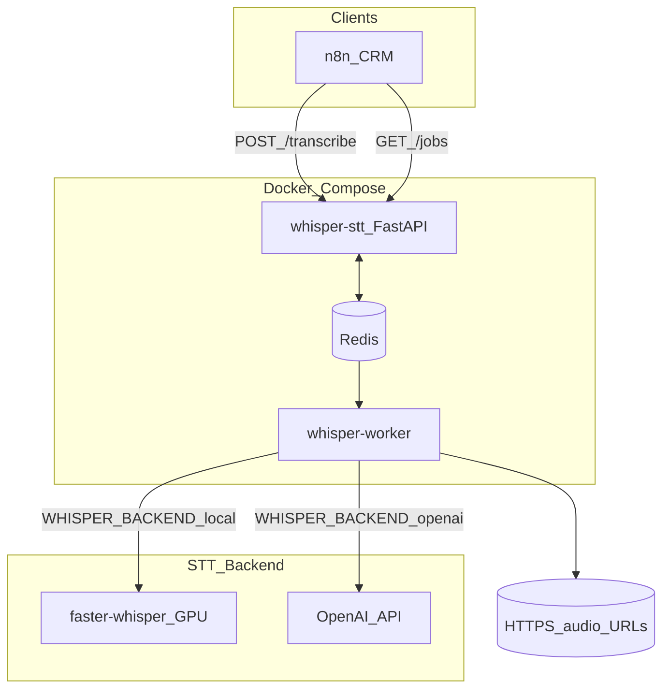

# Архитектура Whisper STT

Подробное описание GPU-/cloud-sidecar сервиса распознавания речи для записей колл-центра: асинхронная очередь Redis, гибридный бэкенд **local** (faster-whisper) / **openai** (облачный API), dual-track RX/TX и опциональная диаризация pyannote.

## Содержание

| Документ | Описание |
|----------|----------|
| [overview.md](./overview.md) | Назначение, принципы, стек, режимы аудио, бэкенды |
| [diagrams.md](./diagrams.md) | **Схемы архитектуры** (контекст, контейнеры, потоки, бэкенды) |
| [components.md](./components.md) | Модули `app/`, тома, модели, зависимости |
| [data-flow.md](./data-flow.md) | Потоки: постановка → обработка → ответ |
| [redis-and-jobs.md](./redis-and-jobs.md) | Ключи Redis, статусы, dedup, watchdog, семафор |
| [deployment.md](./deployment.md) | Docker Compose, env, GPU, масштабирование |

## Кратко о системе



## Критическое правило

```text
HTTP API must never block on GPU / OpenAI transcription.
```

`POST /transcribe` только ставит задачу в Redis и возвращает `job_id`. Распознавание выполняет **whisper-worker**.

## Быстрые ссылки

- Переключение бэкенда: `WHISPER_BACKEND=local|openai` (см. [deployment.md](./deployment.md))
- Параллелизм: `WHISPER_MAX_CONCURRENT_JOBS` (local) и `OPENAI_MAX_CONCURRENT_JOBS` (openai)
- Пользовательский README: [../../README.md](../../README.md)
- Changelog: [../changelog/CHANGELOG.md](../changelog/CHANGELOG.md)
- OpenAPI при запуске: `/docs`, `/redoc`
