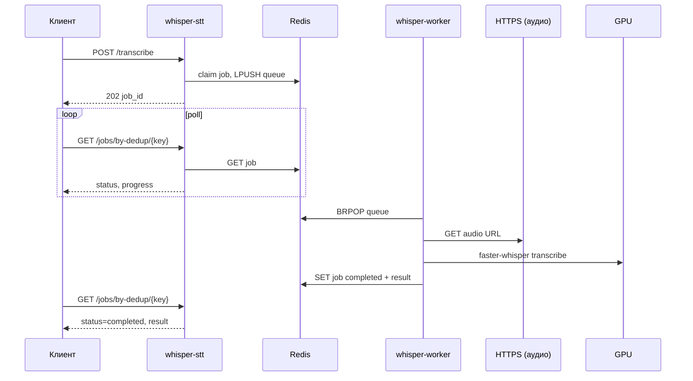

# Потоки данных

## 1. Постановка задачи (клиент → API)

```
POST /transcribe { url | url_rx+url_tx, … }
        │
        ▼
  compute_dedup_key(body)
        │
        ▼
  claim_or_get_existing_job(redis)
        │
        ├─ dedup_lock (whisper:dedup_lock:{key})
        ├─ если активная задача exists → 200 + existing job_id
        └─ иначе: новый UUID, SET whisper:job:{id}, SET whisper:dedup:{key}, LPUSH whisper:queue
        │
        ▼
  202 { job_id, dedup_key, status: "queued" }
```

Клиент далее опрашивает:

- `GET /jobs/{job_id}` — по UUID из ответа POST;
- `GET /jobs/by-dedup/{dedup_key}` — предпочтительно для интеграций, привязанных к файлу записи.

## 2. Обработка задачи (worker)

```
BRPOP whisper:queue
        │
        ▼
  mark_job_claimed_after_brpop → status: waiting_gpu
        │
        ▼
  acquire semaphore (WHISPER_MAX_CONCURRENT_JOBS)
        │  (периодический heartbeat при ожидании слота)
        ▼
  run_transcription_pipeline(body)
        │
        ├─ [dual] prepare_dual_rx_tx_from_urls
        │         ├─ download rx, tx, [mix]
        │         └─ ffmpeg → mono 16 kHz WAV
        │
        ├─ [single] prepare_audio_from_url
        │
        ├─ [sync auto] estimate_rx_tx_offsets_vs_mix
        │
        ├─ transcribe_wav_to_parts / transcribe_with_diarization
        │         └─ faster-whisper (+ pyannote если diarize)
        │
        ├─ build_dual_track_result_from_parts / align speakers
        │
        └─ apply_spelling_fixes, infer speaker roles
        │
        ▼
  build_transcribe_response → dict
        │
        ▼
  save_job: status=completed, result={…}
        │
        ▼
  cleanup temp WAV
```

GPU-работа выполняется в `ThreadPoolExecutor`; asyncio-цикл worker обновляет статус через `step_callback`.

## 3. Статусы шагов пайплайна

| status | current_step (пример) | progress |
|--------|----------------------|----------|
| `downloading` | downloading audio / audio files | 5–8 |
| `syncing_channels` | syncing rx/tx to mix | 15 |
| `transcribing_rx` | transcribing rx channel | 25–30 |
| `transcribing_tx` | transcribing tx channel | 55 |
| `transcribing_mix` | transcribing mono/stereo | 40 |
| `merging_segments` | merging rx/tx / diarizing | 85–40 |

## 4. Формирование ответа

`TranscribeResult` (внутренний dataclass) преобразуется в `TranscribeResponse`:

| Поле | Описание |
|------|----------|
| `transcript` | Полный текст |
| `operator_text` / `client_text` | Агрегаты по ролям (dual_track или diarized) |
| `formatted_text` | Текст для UI с заголовками ролей |
| `diarized_segments` | Список сегментов: speaker, role, start/end, text |
| `role_separation` | `dual_track`, `diarized`, `unavailable_mono`, … |
| `note_ru` | Пояснение для оператора интеграции |

При **mono без диаризации**: `operator_text` и `client_text` = `null`, `role_separation` = `unavailable_mono`.

## 5. Диаграмма последовательности (happy path)



## 6. Dual-track: маппинг каналов на роли

```
call_direction = incoming:
  RX → role: client   (speaker id "RX")
  TX → role: operator (speaker id "TX")

call_direction = outgoing:
  RX → role: operator
  TX → role: client
```

Сегменты с обоих каналов объединяются на общей временной шкале (с учётом sync offsets) и сортируются по `start_sec`.

## 7. Диаризация mono

```
mono WAV
    │
    ├─ faster-whisper → segments + word timestamps
    │
    └─ pyannote → speaker turns (SPEAKER_00, …)
            │
            ▼
    align_whisper_segments
            │
            ▼
    infer_speaker_role_map (catalog.json)
            │
            ▼
    effective_segment_role (+ IVR phrases → operator)
```

Требования: `WHISPER_DIARIZATION=1`, валидный `HF_TOKEN`, принятые условия модели на Hugging Face.
