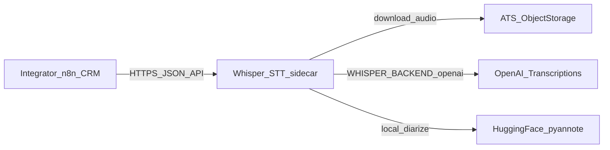
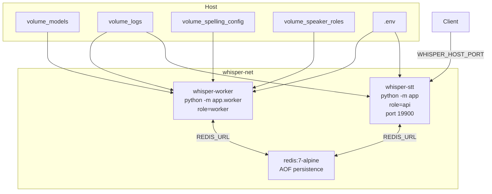
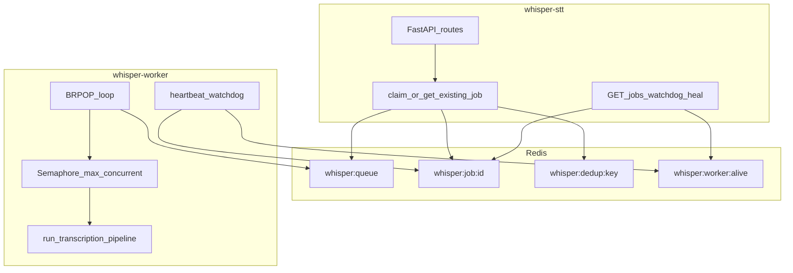
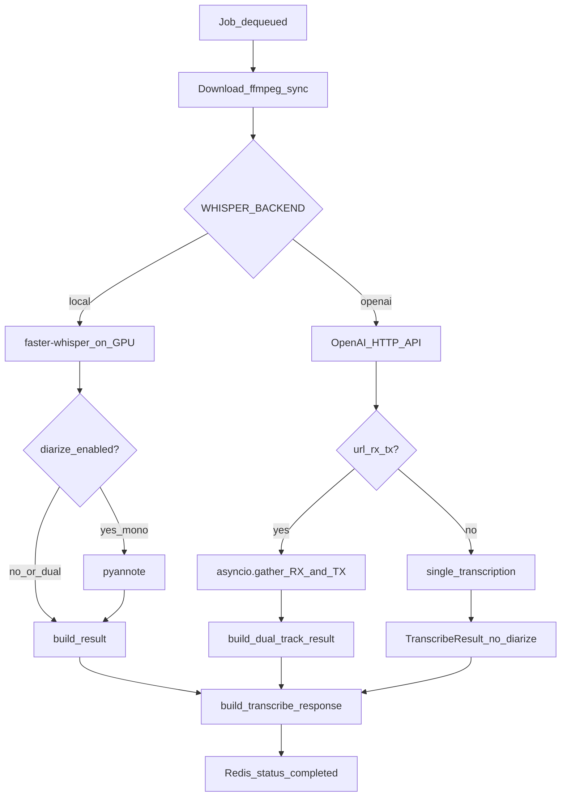
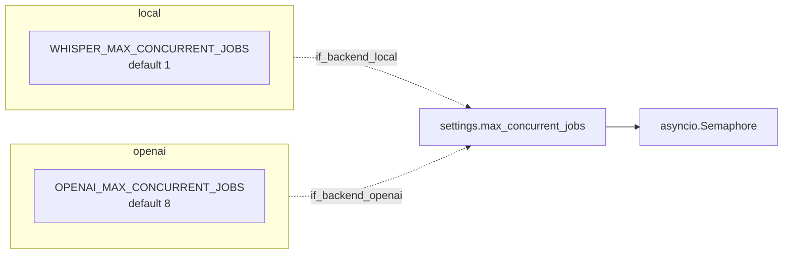
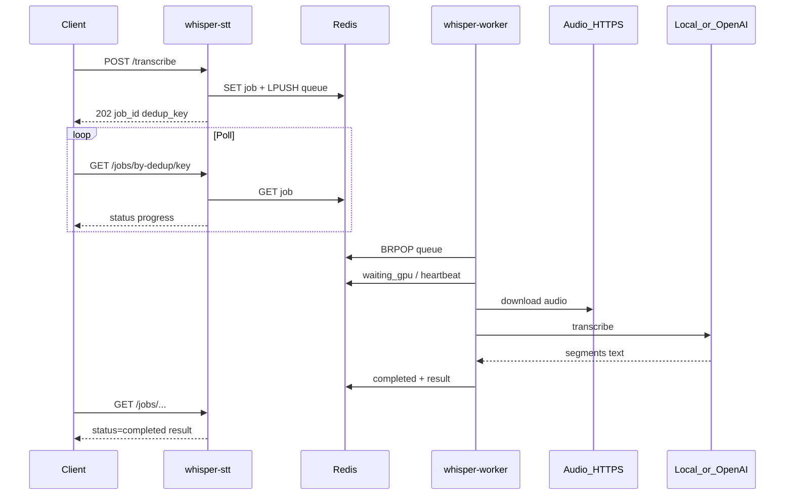
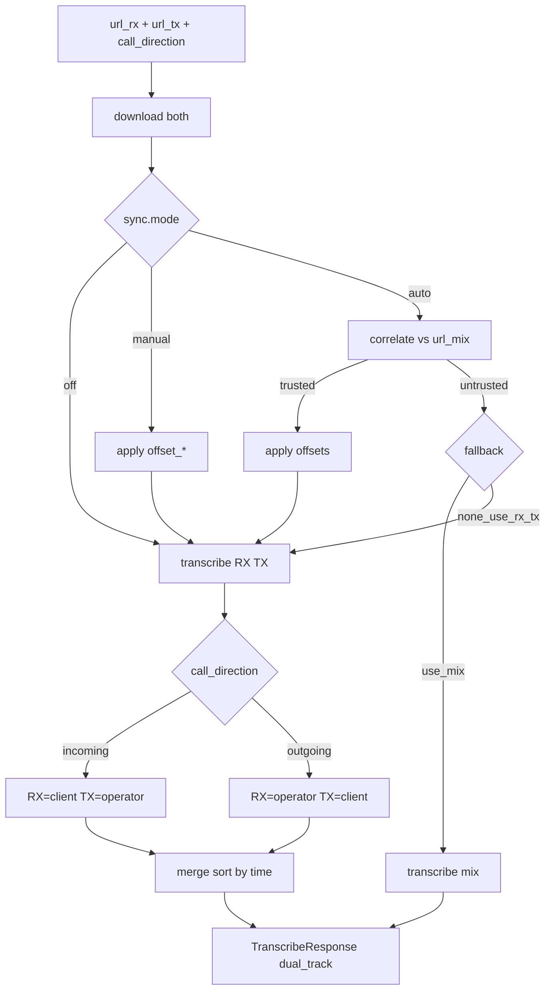
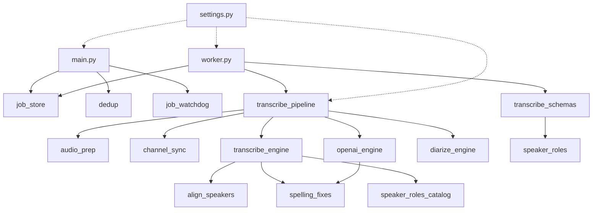
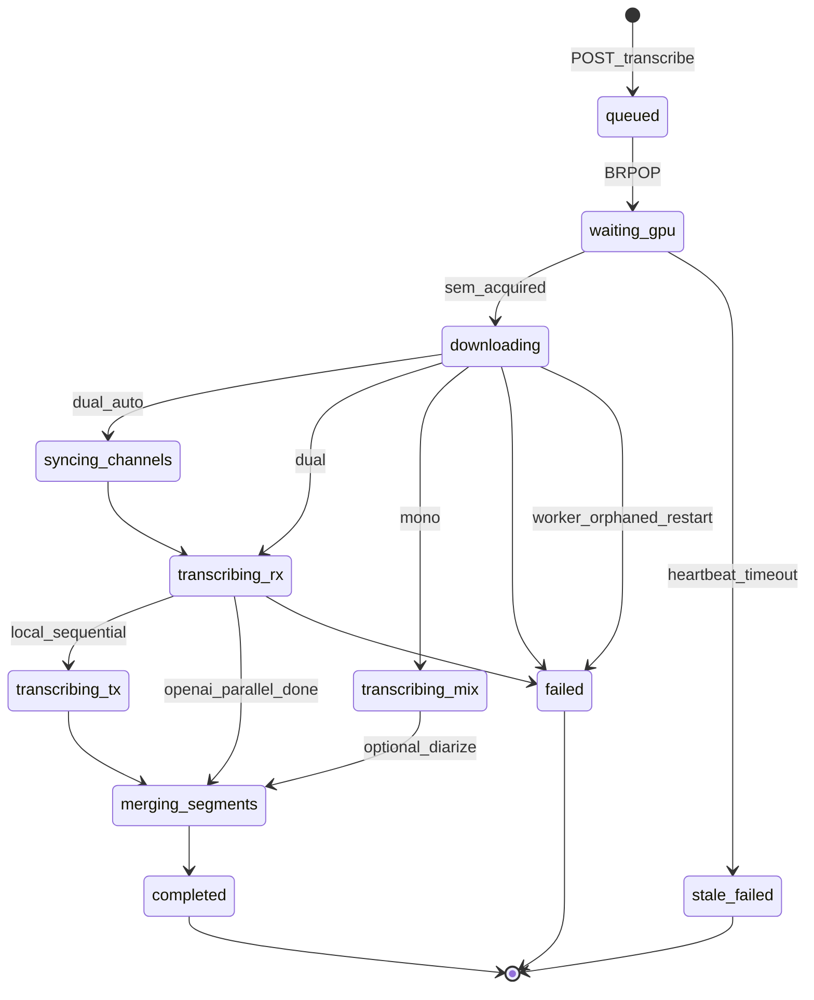
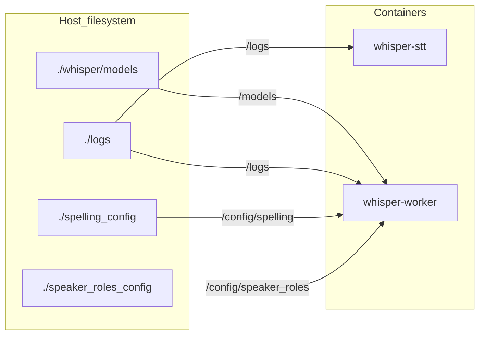

# Схемы архитектуры

Визуальное описание Whisper STT sidecar. Диаграммы в формате Mermaid (рендерятся в GitHub, VS Code, многих Markdown-просмотрщиках).

---

## 1. Контекст системы

Кто взаимодействует с сервисом.

| Участник | Роль |
|----------|------|
| Integrator (n8n, CRM) | `POST /transcribe`, опрос `GET /jobs/*` |
| Whisper STT | Очередь, скачивание, STT, ответ |
| АТС / storage | Источник HTTPS URL записей |
| OpenAI API | Облачное распознавание (опционально) |
| Hugging Face | Модели pyannote (только local + diarize) |
---

## 2. Контейнеры (Docker Compose)

Три сервиса в сети `whisper-net`. Один Docker-образ для API и worker.

| Контейнер | Назначение | GPU |
|-----------|------------|-----|
| `redis` | Очередь `whisper:queue`, job JSON, dedup, alive | нет |
| `whisper-stt` | FastAPI: enqueue + status | runtime nvidia, модель **не** грузит |
| `whisper-worker` | BRPOP → пайплайн STT | да (local) / HTTP к OpenAI (openai) |

---

## 3. Разделение процессов API / Worker

---

## 4. Выбор бэкенда STT

Переключение только через `.env`: `WHISPER_BACKEND`.

### Параллелизм

---

## 5. Последовательность: happy path

---

## 6. Dual-track RX/TX

При `WHISPER_BACKEND=openai` шаги «transcribe RX/TX» выполняются **параллельно** (`asyncio.gather`).

---

## 7. Модули приложения (зависимости)

---

## 8. Жизненный цикл задачи

---

## 9. Развёртывание и тома

---

## Связанные документы

- Текстовый обзор: [overview.md](./overview.md)
- Модули: [components.md](./components.md)
- Детали потоков: [data-flow.md](./data-flow.md)
- Redis/jobs: [redis-and-jobs.md](./redis-and-jobs.md)
- Env и Compose: [deployment.md](./deployment.md)
